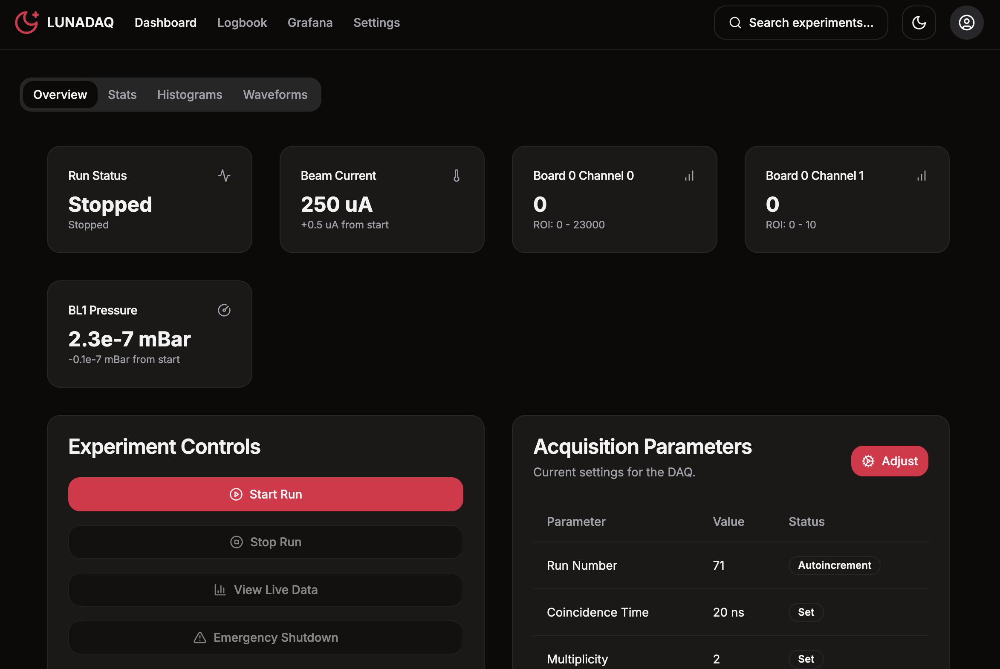

# WebDAQ - LUNA Experiment Data Acquisition System
  




This repository contains a server and a React Next.js frontend designed for data acquisition at the LUNA experiment. The system utilizes XDAQ libraries within Docker to efficiently handle data acquisition processes. Additionally, it manages run metadata to facilitate easy conversion to a FAIR (Findable, Accessible, Interoperable, Reusable) format.

## Features

- **Data Acquisition**: Communicates with Graphite interfaces in the laboratory to gather real-time data.
- **Tetramm Current Acquisition**: Initiates and manages tetramm current acquisition.
- **Data Visualization**: Visualizes spectra and waveforms from each channel using spy sockets of XDAQ.
- **Metadata Handling**: Efficiently processes and stores run metadata for FAIR compliance.

## Technology Stack

- **Backend**: Flask, SQLAlchemy
- **Frontend**: React, Next.js
- **Data Handling**: XDAQ Libraries
- **Containerization**: Docker

## Getting Started

LunaDAQ runs on Linux (the CAEN drivers are Linux-only; macOS works in test mode without hardware).

### Quick install (recommended)

A single script sets everything up on a fresh PC:

```bash
git clone https://github.com/skowrons94/WebDAQ.git
cd WebDAQ
./install.sh
```

The script is **idempotent** — you can re-run it at any time and it skips whatever is already installed. It will ask for the backend API URL. The default `http://127.0.0.1:5001` only works when you open the web page **on the same PC** that runs it. To use LunaDAQ from other computers, enter this PC's IP address instead, e.g. `http://192.168.1.50:5001` (see [Usage](#usage) below).

What it does:

1. **Docker** — installs Docker if missing, enables the service, adds you to the `docker` group, and pulls the `skowrons/xdaq:latest` and `skowrons/xdaq:sync` images.
2. **Miniforge** — installs it if no `conda` is found.
3. **`luna` environment** — created from `environment.yml` (Python, ROOT, Node.js, Flask, …).
4. **RUReader & RUSpy** — cloned from GitHub, built with CMake, installed to `/usr/local/bin`.
5. **Frontend** — writes `NEXT_PUBLIC_API_URL` to `frontend/.env` and runs `npm run build`.
6. **`LunaDAQ` shortcut** — adds an alias to `~/.bashrc`.

> If the script added you to the `docker` group, log out and back in once so Docker works without `sudo`.

### Running

Open a **new terminal** (so the alias and group changes are picked up) and run:

```bash
LunaDAQ
```

This activates the `luna` environment, enters the `frontend/` directory, and starts the web app. Then open **http://localhost:3000** in your browser.

You **do not** need to create a database or a user by hand. When you click **“Start an Experiment”** in the web interface and choose a working directory, the DAQ server is launched there and the database, the default user, and the `conf/`, `calib/`, `data/` folders are created automatically.

### Usage

Open the web interface at `http://<host>:3000`, where `<host>` is the IP address of the PC running LunaDAQ (or `localhost` if you are on that same PC).

**Important — making it reachable from other PCs.** `NEXT_PUBLIC_API_URL` is baked into the frontend at build time and used by your **browser** to reach the DAQ server. If it is left as `http://127.0.0.1:5001`, the browser interprets `127.0.0.1` as *its own* machine, so the page only works on the PC that runs the server — opening it from any other computer will fail to connect.

To make LunaDAQ accessible across the network, set `NEXT_PUBLIC_API_URL` to the **host PC's IP address** (the machine running the server), for example:

```bash
# frontend/.env
NEXT_PUBLIC_API_URL=http://192.168.1.50:5001
```

Then rebuild the frontend so the change takes effect:

```bash
cd frontend && npm run build
```

The install script sets this for you when you enter the IP at its prompt. Notes:

- Use a **LAN IP** (e.g. `192.168.x.x`) to reach it from other machines on the same network. For access over the internet you additionally need a public IP / DNS name plus the appropriate firewall and port-forwarding for ports `3000` and `5001`.
- Other PCs must be able to reach both the frontend (`:3000`) and the backend (`:5001`) on that address.

---

## Advanced / Manual setup

These steps are only needed if you are **not** using `install.sh`, are developing the server, or want to run the components by hand. Most users can skip this section.

<details>
<summary>Manual dependency setup</summary>

Pull the XDAQ image (optional — it is pulled automatically on first launch):

```bash
docker pull skowrons/xdaq:latest
```

Create the conda environment with all Python/Node/ROOT dependencies:

```bash
conda env create -f environment.yml
conda activate luna
```

Build the online-visualization helpers and install them to `/usr/local/bin`:

```bash
for repo in RUReader LunaSpy; do
  git clone https://github.com/skowrons94/$repo.git
  cmake -S $repo -B $repo/build && cmake --build $repo/build -j
done
# RUReader builds 'RUReader'; LunaSpy builds 'RUSpy' — copy them onto your PATH
sudo install -m 755 RUReader/build/RUReader /usr/local/bin/
sudo install -m 755 LunaSpy/build/RUSpy    /usr/local/bin/
```

</details>

<details>
<summary>Running the server manually (database & user)</summary>

The frontend launcher normally does all of this for you. To run the server by hand in a working directory:

```bash
cd server

# One-time database setup
flask db upgrade            # apply migrations (the repo already ships them)

# Create a user (the launcher creates a default 'luna' user automatically)
flask --app server create-user

# Start the server
python3 main.py             # add TEST_FLAG=True to run without hardware
```

Then build and start the frontend:

```bash
cd frontend
npm install
npm run build
npm run start
```

</details>

### License

This project is licensed under the MIT License - see the LICENSE file for details.

### Contributing

Contributions are welcome! Please submit a pull request or open an issue for any enhancements or bug fixes.

### Contact

For any inquiries or support, please contact:

* jakub.skowronski@pd.infn.it
* alessandro.compagnucci@gssi.it
* gesue.riccardo@gssi.it 
