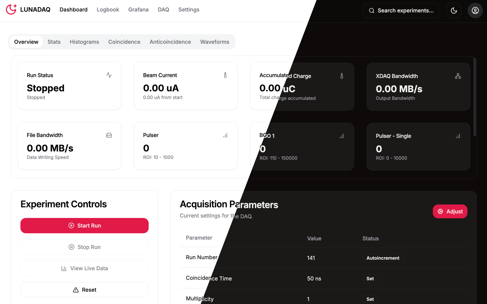

# WebDAQ - LUNA Experiment Data Acquisition System
  




This repository contains a server and a React Next.js frontend designed for data acquisition at the LUNA experiment. The system utilizes XDAQ libraries within Docker to efficiently handle data acquisition processes. Additionally, it manages run metadata to facilitate easy conversion to a FAIR (Findable, Accessible, Interoperable, Reusable) format.

## Features

- **Data Acquisition**: Communicates with Graphite interfaces in the laboratory to gather real-time data.
- **Tetramm Current Acquisition**: Initiates and manages tetramm current acquisition.
- **Data Visualization**: Visualizes spectra and waveforms from each channel using spy sockets of XDAQ.
- **Metadata Handling**: Efficiently processes and stores run metadata for FAIR compliance.

## Technology Stack

- **Backend**: Flask, SQLAlchemy
- **Frontend**: React, Next.js
- **Data Handling**: XDAQ Libraries
- **Containerization**: Docker

## Getting Started

### Prerequisites

- Docker
- Node.js (v14 or higher)
- Python (v3.7 or higher)
- Flask
- SQLite
- (Optional) conda

### Installation

1. **Clone the repository**

   ```bash
   git clone https://github.com/skowrons94/WebDAQ.git
   cd WebDAQ
   ```

2. **Set up docker**
    
    Since the XDAQ is running in a closed container due to heavy dependencies, the newest image must be pulled before starting the DAQ server:
    ```bash
    docker pull skowrons/xdaq:latest
    ```
    This is not required, since when the server asks for the docker to start the image, it will be automatically pulled, but since it takes some time and it is a test of either docker is correctly installed on the PC, it is advised to run it beforehand.

3. **Set up conda**

    For easy run of all the components, a conda environment was prepared and can be installed with:
    ```bash
    conda env create -f environment.yml 
    ```
    This will install all the necessary packages to run both the frontend and the server.
    

### Setting Up

First it is necessary to install the server. It takes care of handling the DAQ, the online analysis and the database where all the metadata are stored:

1. **Navigate to server directory:**
    ```bash
    cd server
    ```

2. **Initialize the database:**
    ```bash
    flask db init
    flask db migrate -m "Initial migration."
    flask db upgrade
    ```

3. **Create a new user:**
    ```bash
    flask --app server create-user
    ```

4. **Start the Flask server:**
    ```bash
    python3 main.py
    ```

At this point our DAQ server should be running and ready to accept the calls from the frontend, that we will start using the following:

1. **Navigate to frontend directory:**
    ```bash
    cd frontend
    ```

2. **Install dependencies and build the server:**
    ```bash
    npm install
    npm run build
    ```

3. **Start the frontend:**
    ```bash
    npm run start
    ```

### Usage

Once both the server and frontend are running, you can access the application via your web browser at ```http://localhost:3000```. It communicates with the server that is located at ```http://localhost:5001```. In case the server is located on an another PC, its IP address should be set in the ```.env``` file that is located in ```frontend/``` folder.

### License

This project is licensed under the MIT License - see the LICENSE file for details.

### Contributing

Contributions are welcome! Please submit a pull request or open an issue for any enhancements or bug fixes.

### Contact

For any inquiries or support, please contact:

* jakub.skowronski@pd.infn.it
* alessandro.compagnucci@gssi.it
* gesue.riccardo@gssi.it 
