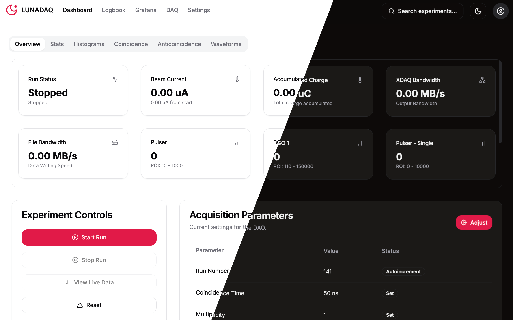

# LUNA Experiment Data Acquisition System

  

Welcome to LunaDAQ, the modern data acquisition and visualization system developed for the **LUNA (Laboratory for Underground Nuclear Astrophysics)** experiment. This system integrates real-time data collection, analysis, and FAIR-compliant metadata management in a user-friendly web interface.

## Documentation Hub

| Section          | Description                                                                 | Link                               |
|------------------|-----------------------------------------------------------------------------|------------------------------------|
| **[Installation]**  | Detailed guide for setting up LunaDAQ      | [View Installation Guide](installation.md) |
| **[User Guide]**    | Detailed guide for the LunaDAQ functionalities         | [View Usage Guide](usage.md)               |

## Key Capabilities

- **Real-time Data Acquisition** from multiple detector channels
- **Interactive Visualization** of spectra and waveforms
- **FAIR Metadata Management** for experimental runs
- **Secure User Authentication** with role-based access
- **Dockerized Analysis Pipeline** with XDAQ integration

## Support

For technical support or feature requests:
- Jakub Skowroński: [jakub.skowronski@pd.infn.it](mailto:jakub.skowronski@pd.infn.it)
- Alessandro Compagnucci: [alessandro.compagnucci@gssi.it](mailto:alessandro.compagnucci@gssi.it)