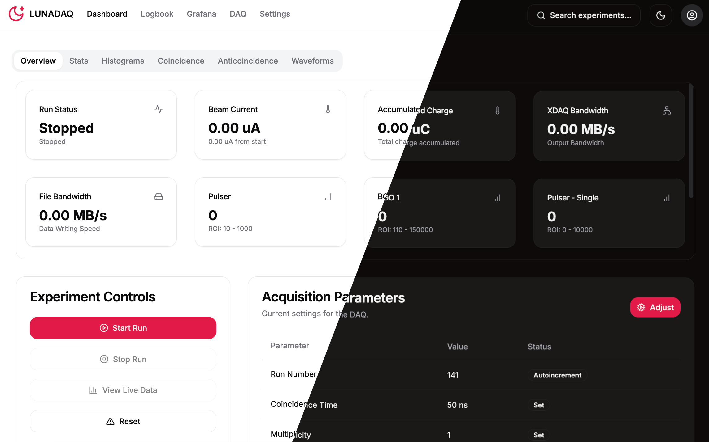

# WebDAQ — data acquisition for the LUNA experiment

  

Run control for CAEN digitizers, in a browser. Configure the boards, tune the
filters against a live spectrum, take runs, watch the rates and the beam current,
and write the shift entry — from the same interface, on the DAQ machine or from
any PC on the network.

Acquisition runs **in process**: the boards are read, decoded and written by
[CaenDAQ](https://github.com/skowrons94/CaenDAQ), a C++ library bound into the
Python server. There is no XDAQ, no Docker container and no separate monitoring
process.

## Where to start

**New here?** Read [A complete session](example-session.md) — one run from a cold
machine to a written logbook entry.

| Section | Read it for |
|---------|-------------|
| [Installation](installation.md) | Getting it onto a machine. |
| [A complete session](example-session.md) | The whole workflow, end to end. |
| [How WebDAQ works](details.md) | What happens when you press Start; what is stored and where; what can be changed during a run. |
| [User guide](usage.md) | Screen-by-screen reference. |
| [CAEN digitizers](caen-settings.md) | Scanning and adding boards, thresholds and trapezoid settings, PSD gates, multi-board synchronisation, online tuning. |
| [Spectra and ROIs](histograms-and-rois.md) | The histogram dashboard, regions of interest, and the per-run `roi.json`. |
| [Beam current and charge](current-and-charge.md) | TetrAMM, RBD 9103, a monitored Graphite value, and what the two accumulated charges mean. |
| [Monitoring and alerts](monitoring-and-alerts.md) | Graphite, Grafana, the Stats page, `stats.csv`, run-linked alerts, Telegram. |
| [ELOG](elog.md) | Reading and writing the collaboration logbook from run control. |
| [Directory structure](directory-structure.md) | What lives where in the repository and in a working directory. |
| [Server architecture](server-architecture.md) | Technical reference for developers. |
| [Troubleshooting](troubleshooting.md) | When something does not work. |

## Key capabilities

- **In-process acquisition** of multiple CAEN digitizers into one synchronised
  `.caendat` file per run
- **Online tuning** of thresholds, gates and trapezoid parameters while the run
  is going
- **Live spectra, waveforms and PSD plots**, with server-side regions of interest
  recorded into each run
- **Beam current and accumulated charge** from a picoammeter or from a monitored
  accelerator value
- **Rates and slow control** archived to Graphite, with Grafana alerts tied to
  the run
- **FAIR-compliant run metadata**, ELOG logbook entries and Telegram alerts

## Support

For technical support or feature requests:
- Jakub Skowroński: [jakub.skowronski@pd.infn.it](mailto:jakub.skowronski@pd.infn.it)
- Alessandro Compagnucci: [alessandro.compagnucci@gssi.it](mailto:alessandro.compagnucci@gssi.it)
- Riccardo Gesuè: [gesue.riccardo@gssi.it](mailto:gesue.riccardo@gssi.it)
